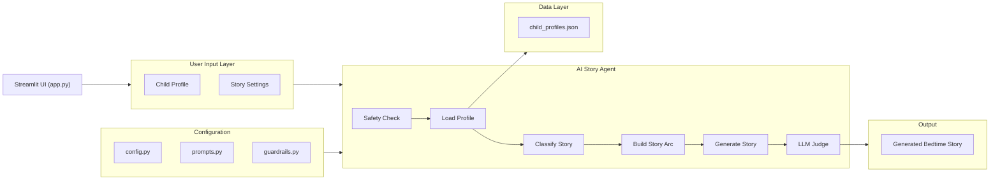
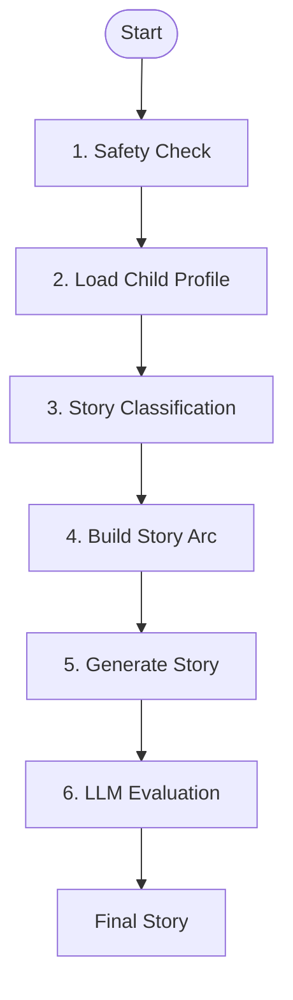
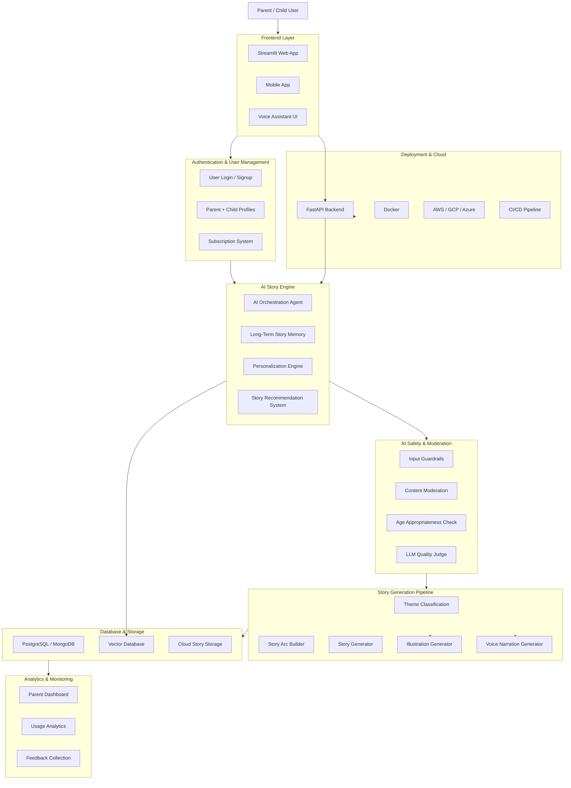

# AI Bedtime Story Generator 🌙✨

An AI-powered bedtime storytelling application built with **Python**, **Streamlit**, and **OpenAI APIs** that generates safe, personalized, and calming bedtime stories for children aged 5–10.

The application supports:
- Personalized child profiles
- Story theme customization
- AI orchestration workflow
- Safety guardrails
- Structured story generation
- Interactive Streamlit UI

---
# Prototype Demo

https://magicalbedtimestory.streamlit.app/

---
# 🚀 Project Overview

This project creates magical bedtime stories tailored to a child’s:
- Name
- Age
- Interests
- Favorite themes
- Story preferences

The system uses an orchestration-style AI agent workflow to:
1. Validate safety
2. Load child profile data
3. Classify the story theme
4. Build a story arc
5. Generate a calming bedtime story
6. Evaluate story quality and safety

---

# 🏗️ System Architecture

## High-Level Block Diagram



---

# 📂 Project Structure

```bash
Child_Bedtime_Story/
│
├── app.py                    # Streamlit frontend
├── agent.py                  # AI orchestration workflow
├── prompts.py                # Prompt templates
├── guardrails.py             # Safety validations
├── llm_judge.py              # Story quality evaluator
├── child_profiles.py         # Child profile management
├── child_profiles.json       # Stored profiles
├── config.py                 # App configurations
├── tools.py                  # Tool definitions/display
├── requirements.txt          # Dependencies
├── .env                      # OpenAI API key
└── README.md
```

---

# ⚙️ Tech Stack

| Category | Technologies |
|---|---|
| Frontend | Streamlit |
| Backend | Python |
| AI/LLM | OpenAI API |
| Data Storage | JSON |
| Environment Management | dotenv |
| Validation | Guardrails |
| Prompt Engineering | Custom Prompt Templates |

---
# Trade Off

1. Prompt more context vs Token cost
2. Safety vs API cost

# 🧠 AI Agent Workflow

The AI orchestration follows a structured multi-step workflow:



---

# 🛡️ Safety Features

The application includes multiple safety layers:
- Input moderation
- Age-appropriate story generation
- Calm bedtime-focused narratives
- Unsafe content filtering
- LLM-based story evaluation

---

# 💻 Installation

## 1. Clone the Repository

```bash
git clone https://github.com/DeepikaDG2310/Child_Bedtime_Story.git
cd Child_Bedtime_Story
```

## 2. Create Virtual Environment

```bash
python -m venv venv
```

Activate environment:

### Windows
```bash
venv\Scripts\activate
```

### Mac/Linux
```bash
source venv/bin/activate
```

## 3. Install Dependencies

```bash
pip install -r requirements.txt
```

## 4. Add OpenAI API Key

Create a `.env` file:

```env
OPENAI_API_KEY=your_api_key_here
```

## 5. Run Application

```bash
streamlit run app.py
```

---

# 🎨 Features

## 👧 Child Profiles
- Save child preferences
- Personalized storytelling
- Persistent profile management

## 📚 Story Customization
- Adventure
- Fantasy
- Animals
- Space
- Friendship
- Educational themes

## 🤖 AI Story Generation
- Dynamic storytelling
- Context-aware prompts
- Structured narrative generation

## 🛡️ AI Safety Pipeline
- Guardrails
- Prompt validation
- LLM quality checking

---

# 🔮 Future Improvements

- User authentication
- Database integration
- Voice narration
- Story illustrations
- Multi-language support
- Story history
- Parent dashboard
- Fine-tuned storytelling models

# 🔮 Future Implementation Architecture



---

# 🚀 Planned Future Features

## 👨‍👩‍👧 Parent Ecosystem
- Parent dashboard
- Story history tracking
- Reading analytics
- Sleep pattern insights

## 📱 Cross Platform Support
- Mobile application
- Tablet optimization
- Smart speaker integration

## 🎨 AI Multimedia Generation
- AI-generated story illustrations
- Character consistency
- Voice narration
- Ambient bedtime music

## 🧠 Advanced AI Personalization
- Long-term memory
- Child preference learning
- Adaptive storytelling
- Educational personalization

## ☁️ Production Infrastructure
- FastAPI backend
- Cloud deployment
- Docker containers
- CI/CD pipelines
- Database integration

## 🔐 Authentication & Monetization
- Secure login system
- Parent accounts
- Subscription plans
- Premium story packs

## 🌍 Scalability & Internationalization
- Multi-language stories
- Regional storytelling styles
- Scalable cloud infrastructure

# 🤝 Contributing

Contributions are welcome!

1. Fork the repository
2. Create feature branch
3. Commit changes
4. Open a Pull Request

---

# 📜 License

This project is licensed under the MIT License.

---

# 👩‍💻 Author

Created by Deepika D

GitHub Repository:  
https://github.com/DeepikaDG2310/Child_Bedtime_Story
